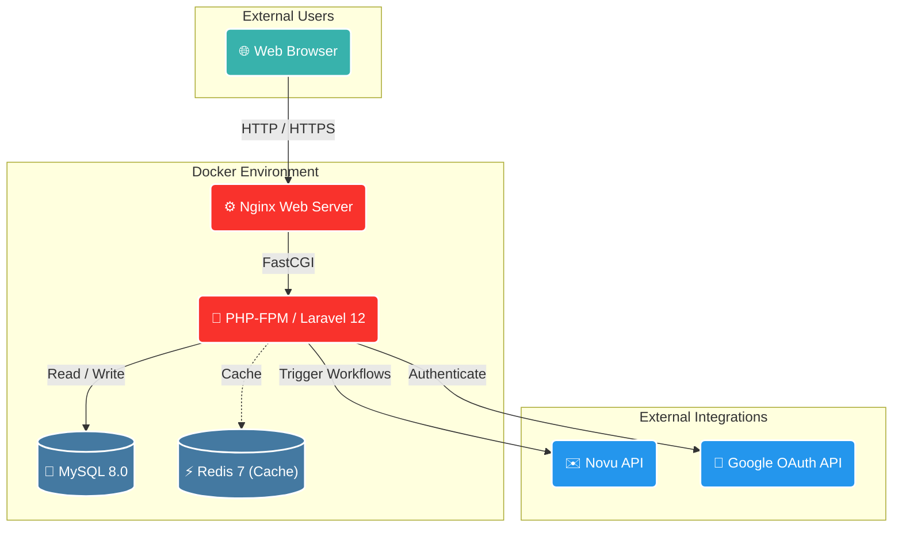
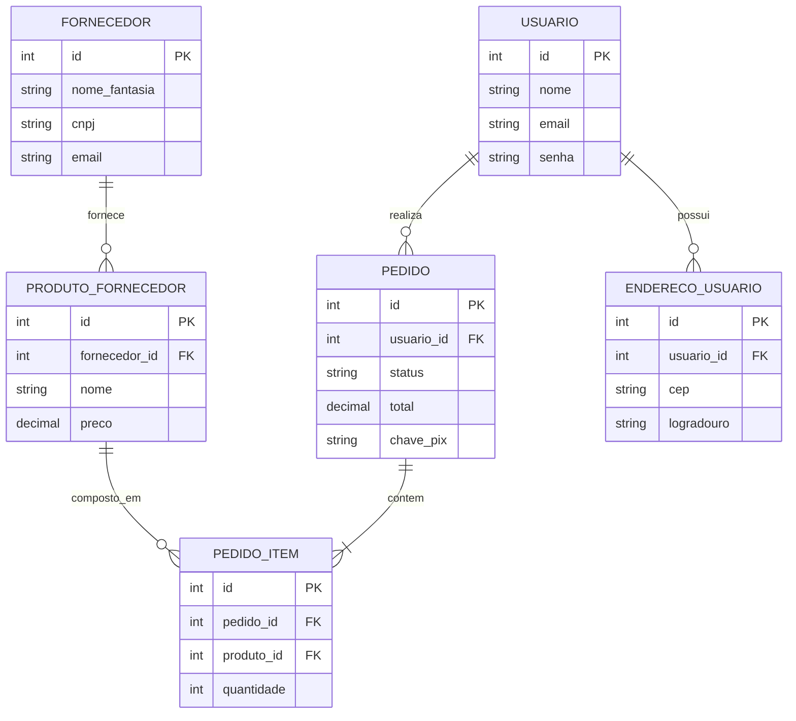

# 🌟 Hydrax — E-commerce de Tênis

<p align="center">
  
  
  
  
  
</p>

## Overview

**Hydrax** is a modern e-commerce web application focused on the buying and selling of sneakers. Initially developed as an academic capstone project (TCC), the system simulates a complete e-commerce ecosystem including customers, suppliers, order management, and administrative dashboards.

The platform provides a secure and data-oriented shopping experience, separating concerns between different user roles: Customers, Suppliers, and System Administrators.

## Tech Stack

- **Backend:** Laravel 12.0 (PHP 8.2)
- **Frontend:** Laravel Blade Templates, Tailwind CSS (via CDN), Chart.js
- **Database:** MySQL 8.0
- **Cache & Queue:** Redis 7 (Optional)
- **Infrastructure:** Docker & Docker Compose, Nginx
- **Authentication:** Laravel standard Auth, Laravel Socialite (Google OAuth)
- **Notification Infrastructure:** Novu API

## Features

### 🛒 Customer Workflows
- Account registration, login, and profile management.
- Multi-address management.
- Wishlist and shopping cart functionality.
- Product browsing, filtering (by brand, size, gender), and reviews.
- Order checkout with simulated PIX payment generation.
- Order history and tracking.
- Google OAuth login integration.

### 📦 Supplier Workflows
- Dedicated registration and approval flow.
- Product and inventory management.
- Dashboard with real-time metrics (sales, revenue, low stock alerts).
- Upload product images and manage labels.

### ⚙️ Administrative Features
- Global dashboard with ecosystem-wide metrics (top products, weekly revenue).
- Approve or reject pending supplier registrations.
- Customer and supplier management.
- Coupon and discount code management.
- Cross-platform sales reporting.

### 🧪 Experimental / Legacy Features
- **AI Product Search (`/ia/buscar`):** An experimental multimodal search feature relying on an external Python script. *(Note: The script path is currently hardcoded and the source file is missing from the repository).*

## Architecture

Hydrax operates as a monolithic application utilizing the MVC (Model-View-Controller) design pattern provided by Laravel.

### System Diagram



### Database Architecture



## Requirements

To run this project locally, you will need:
- **Docker** and **Docker Compose**
- *(Alternatively)* PHP 8.2+, Composer, and MySQL 8.0 if running outside of Docker.

## Installation

The project includes an automated Docker setup for local development.

1. **Clone the repository:**
   ```bash
   git clone https://github.com/CaioSouzx00/Hydrax.git
   cd Hydrax
   ```

2. **Configure Environment Variables:**
   ```bash
   cp apps/hydrax/.env.example apps/hydrax/.env
   ```
   *Note: Update the database credentials and API keys in `.env` as needed.*

3. **Start the Docker Containers:**
   ```bash
   ./scripts/docker-up.sh
   ```
   This script will build the images and start the Nginx, PHP-FPM, MySQL, and Redis containers.

4. **Install Dependencies & Setup Database:**
   Once the containers are up, execute the setup inside the application container:
   ```bash
   docker exec -it hydrax_app bash
   composer install
   php artisan key:generate
   php artisan migrate
   ```

5. **Seed the Database (Optional):**
   To populate the database with default users, brands, and suppliers:
   ```bash
   # Inside the container or using the local script
   ./scripts/seed.sh
   ```

6. **Access the Application:**
   The application will be available at `http://localhost`.

## Configuration

### Environment Variables

Important configuration keys in `apps/hydrax/.env`:
- `NOVU_API_KEY` / `NOVU_API_URL`: Required for the email notification workflows (abandoned cart, order updates, PIX keys).
- `GOOGLE_CLIENT_ID` / `GOOGLE_CLIENT_SECRET`: Required for Google Socialite authentication.
- `DB_*`: MySQL connection parameters.

*Note: Never commit real API keys or production database credentials to the repository.*

## Security Considerations

- **Authentication Middleware:** Routes are strictly separated by user roles using `UsuarioMiddleware`, `AdministradorMiddleware`, and `FornecedorMiddleware`.
- **Payment Handling:** The system currently simulates a PIX payment generation (`hydrax-pix-XYZ`). It does not process real financial transactions or store credit card data.
- **Python Script Execution:** The `IAController` utilizes `Symfony\Component\Process\Process` to execute a local Python script. In a production environment, this approach should be securely isolated to prevent arbitrary command execution.

## Technical Limitations

- **Frontend Build System:** The frontend currently relies heavily on a Tailwind CSS CDN rather than a compiled asset pipeline (Vite is configured in Laravel but not actively bundling the views).
- **Hardcoded Paths:** The AI search functionality relies on a hardcoded Windows Python path (`C:\Users\...\python.exe`) which will fail in Docker or Linux environments.
- **Missing Tests:** Automated tests are minimal. The `test.sh` script is provided, but comprehensive test coverage is not present.

## Contributing

This is an academic project. Contributions were made by the original team members based on the official GitHub commit history.

- **CaioSouzx00**
- **YagoPaulino**
- **rayjhonatann**
- **Yushf1218**

## Project Status
**Status:** Completed / Academic  
This project was primarily developed as a Capstone Project (TCC) and serves as an educational showcase of a full-stack Laravel application.
